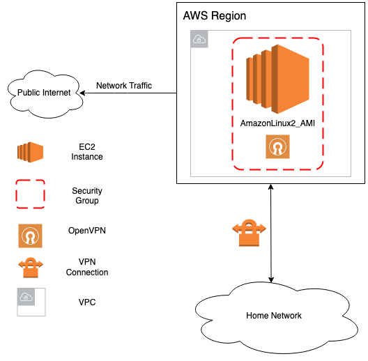

# OpenVPN on AWS 

This repository contains a one-stop Terraform module that creates a single node [OpenVPN Server](https://en.wikipedia.org/wiki/OpenVPN) in a dedicated AWS VPC and subnet. The OpenVPN server is configured to be readily accessible by the users supplied in the Terraform input file. The same Terraform input file can be used to subsequently update the list of authorised users.

The master branch in this repository is compliant with [Terraform v0.12](https://www.terraform.io/upgrade-guides/0-12.html);

## Getting Started

### Prerequisites

Before you can use the Terraform module in this repository out of the box, you need

 - an [AWS account](https://portal.aws.amazon.com/gp/aws/developer/registration/index.html)
 - a [Terraform](https://www.terraform.io/intro/getting-started/install.html) CLI
 - a list of users to provision with OpenVPN access

Moreover, you probably had enough of people snooping on you and want some privacy back or just prefer to have a long lived static IP.

### QuickStart Installation

```
set_me_up.sh -r <region> -c <aws_credentials_file> -p <profile> -u <ovpn_users>

usage: set_me_up.sh -r us-east-1 -c ~/.aws/credentials -p default -u userOne,userTwo
-r : REGION: aws region, e.g. aws-east-1
-c : AWS_CREDENTIALS: aws credentials, usually under ~/.aws/credentials
-p : AWS_PROFILE: aws profile, specify your aws profile to use
-u : OVPN_USER_PROFILES: comma seperated list of ovpn user settings to crate, e.g. userOne,userTwo
```

The OpenVPN configuration file can be found under the following directory:
```
generated/ovpn-config/userOne.ovpn
```

You can either import it using the CLI
```
sudo openvpn --config generated/ovpn-config/userOne.ovpn 
```

Or just double click the .ovpn file using your window manager to import it...

## Architecture

The installation always use the latest Amazon_Linux_2 AMI, it does not make use of the AWS Marketplace OpenVPN AMI. That means that the only
cost incurred is that from using common AWS resources.



## Setup

Comprehensive setup instructions can be found in the following section [Setup](./documentation/Setup.md)

## FAQ

See [FAQ](./documentation/FAQ.md)

## Credits

> Thanks https://www.how-hard-can-it.be/author/dominic/ for providing the initial repo. This repo is a fork.

>This repository relies on the great [openvpn-install.sh](https://github.com/angristan/openvpn-install/blob/master/openvpn-install.sh) Bash script from [https://github.com/angristan/openvpn-install](https://github.com/angristan/openvpn-install) to do the OpenVPN plumbing under the bonnet. Keep up the good work, Stanislas Lange, aka [angristan](https://angristan.xyz/)!
